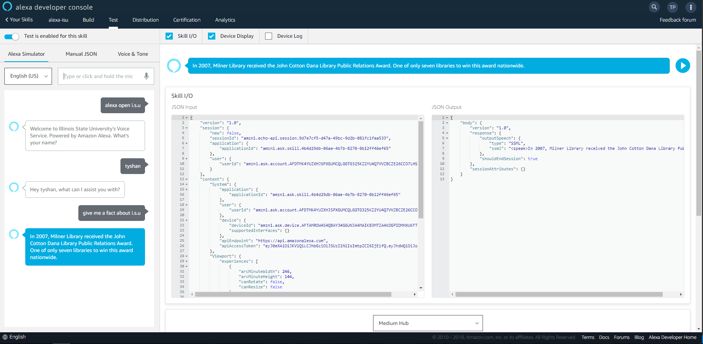
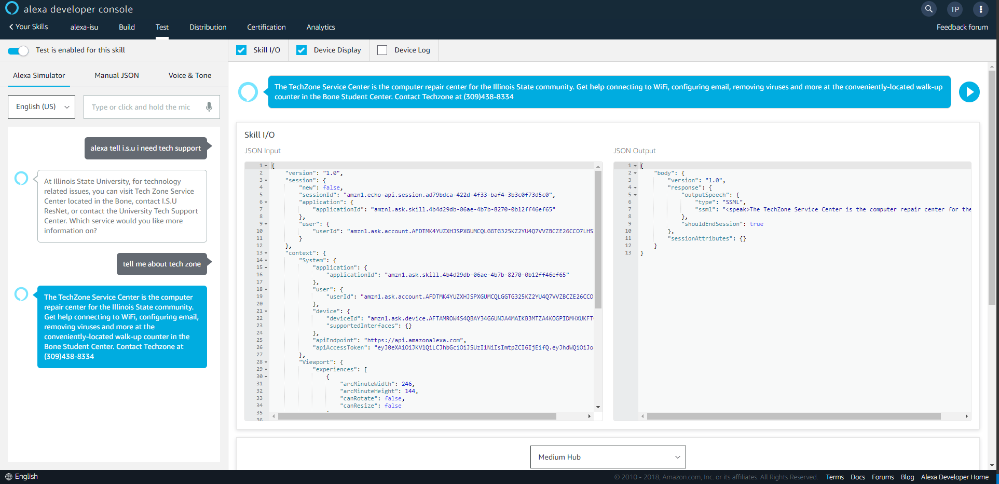

# Welcome to ISU's Voice Service

#### What You NEED

- Node/NPM
- Amazon Developer Account
- ASK CLI
- Jovo CLI

# To Install
1. Clone Git Repository
2. NPM Install node packages
3. Jovo Build
4. Jovo Deploy
5. Jovo Run
6. Test Skill on Amazon Developer Console

### Invocation name : I.S.U

##### Example
###### "Alexa Open I.S.U"
###### "Alexa tell I.S.U I need tech support" 

##### INTENTS

- Hello ISU
- Financial Aid
- ISU Fact
- Techology Problems
- Tech Zone
- RES NET
- IT HELP 

### ISU Fact Intent example

### ISU Technology Problems/Tech Zone Intent

